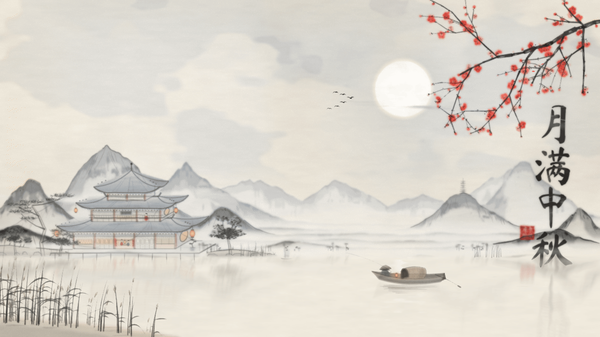
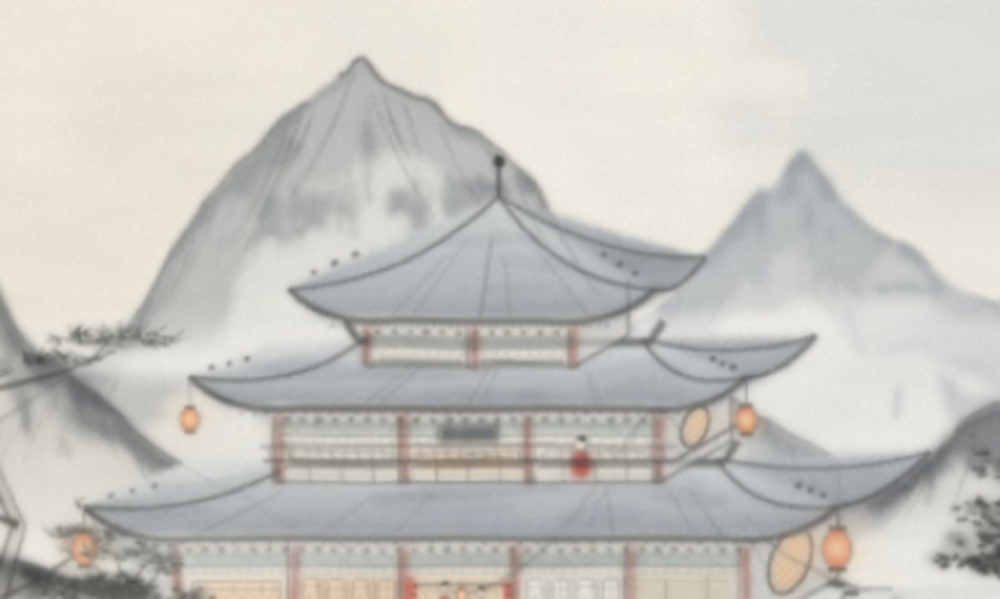

# ink-wash-painting

**A Claude skill that paints Chinese ink-wash (水墨) of any subject as live browser art — WebGL2 shaders for paper, water and ink, Canvas brushwork, no images and no libraries.**



<sub>The reference scene, 月满中秋 (<i>full moon, mid-autumn</i>) — geese, petals and lamplight are drawn with the same brush code every frame. **[See it running live →](https://research.23ag.one/ink-wash)**</sub>

---

It is not a scene generator. The skill teaches Claude how an ink painter *sees* a subject, how paper, water and brush behave, and how to criticise its own picture — then Claude writes a new renderer for every request, reusing only the generic material core.

> Quality comes from four things, in this order: **translating the subject into the painter's language**, **composition by the canon**, **material and brush that hide the computer**, and **inspection at zoom**.

## How a painting gets made

| Step | What happens | Reference |
|---|---|---|
| **1. See** | Five questions before any code: the spirit of the subject (神), what is solid and what is empty (实 / 虚), the family of line, the depth planes, the format. | [`references/seeing.md`](references/seeing.md) |
| **2. Compose** | One host and its guests (主宾), empty paper as a shape (留白), hiding and revealing (藏露), one focal point, 1–3 red accents, at most one inscription and one seal. | [`references/composition.md`](references/composition.md) |
| **3. Material** | Fibre-ridged paper; every mark writes a wetness map that diffuses along the fibres (~36 steps on half-float targets), with edge darkening, granulation and a halo. | [`references/materials.md`](references/materials.md) |
| **4. Brush** | Width noise by arc length, pressed entry and lifted exit, a dark core offset for 中锋 / 侧锋, drying into flying white (飞白). Ten stroke families. | [`references/brush.md`](references/brush.md) |
| **5. Render** | Everything ordered by depth 0…1; washes go through diffusion, a separate ink layer sits on top. | [`references/renderer.md`](references/renderer.md) |
| **6. Critique** | At least two rounds on six zoomed crops — composition, tone, execution, grounding, motion — and an honest note on what is still weak. | [`references/critique.md`](references/critique.md) |



<sub>Detail at 2×. The ~50 symptom → cause → fix lessons behind it are in [`references/pitfalls.md`](references/pitfalls.md).</sub>

## Install

```bash
git clone https://github.com/23ag1/ink-wash-painting-skill ~/.claude/skills/ink-wash-painting
```

Then ask Claude for a painting — *“a canal city in mist, in Chinese ink style”*, *“a pagoda at dusk, 水墨”*, *“a cat on a windowsill in the rain, sumi-e”*.

## Run the reference scene

```bash
cd reference && python3 serve.py 8770
# → http://localhost:8770/index.html
```

`scripts/new-painting.sh` starts a new painting with the generic core only (brush library, fibre diffusion, watercolour filter) — never with the reference scene.

## What's inside

```
SKILL.md                workflow and principles
references/             seeing · composition · materials · brush · renderer · critique · pitfalls
reference/              the worked example: 1,999 lines of JS + GLSL, WebGL2 + Canvas
scripts/new-painting.sh scaffold a new painting from the generic core
evals/evals.json        test prompts: a pagoda, a canal city in mist, a cat in the rain
```

## Example: 雨市 (Rain Market)
`examples/rain-market/` — a vertical scroll made by the skill on a subject unrelated to the reference scene
(a market street in rain, built with the research → notan → motif study → top-down critique workflow).
Run it: `cd examples/rain-market && python3 serve.py 8770` → http://localhost:8770/index.html
It is an honest test result, not a showcase: composition and void work; motifs up close (tiles, figures) are
still weaker than the composition.

## Honest limits

- No photographic detail, cast shadows or full colour — by design.
- Faces, hands and anatomy are weak.
- New subjects start without motif code; only one reference scene exists so far.
- Needs WebGL2 with `EXT_color_buffer_float`.

## Prior work

MoXi (Chu & Tai) · Curtis et al., *Computer-generated watercolor* · Bousseau et al., *Interactive watercolor rendering* · Lingdong Huang, [shan-shui-inf](https://github.com/LingDong-/shan-shui-inf)

---

Part of [23AG Research](https://research.23ag.one/) — the full write-up is at [research.23ag.one/ink-wash](https://research.23ag.one/ink-wash).
